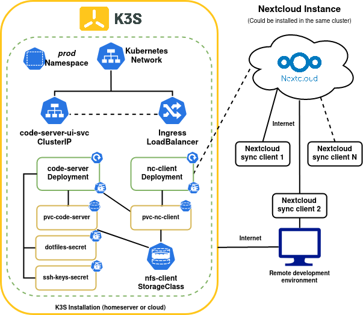

# How to setup a remote development environment with code-server and nextcloud

In this tutorial we are going to setup a complete remote work environment with the ability to sync our workspace directory across multiple devices using `nextcloud` and `code-server` as web editor. 

We can use this work environment if we need to use a powerful computer using a cloud server or just to keep our environment from anywhere at any time on the internet.

## Prerequisites

In this tutorial you need to have the following components
- A kubernetes cluster (I recommend to use [k3s.io](https://k3s.io))
- A nextcloud installation (you can install via [helm](https://github.com/nextcloud/helm) within the same k8s cluster)
- A k8s storage class where you can save your files

All kubernetes manifest files are stored in [this](https://github.com/ivanmorenoj/code-server-nextcloud) repository feel free to clone and customize

## System Architecture
This is the system architecture used in this tutorial



We are going to use a kubernetes storage class to save our files and share between `code-server` and `nc-client` deployments.

## Configure nextcloud sync client 
In order to sync all out files across multiple devices we are going to use `nextcloud` as sync system, in this tutorial we used the `nextcloudcmd` command to sync our files using a docker container.

The docker used syncs the nextcloud remote directory every X seconds, you need to set the `NC_USER`, `NC_PASS` and `NC_HOST` in the `k8s/conf/nextcloud-client-conf.yaml` file, the `NC_PASS` is a secret file, so you'll need to encode as `base64` (example: `echo -n 'verysecretpass' | base64`).

Create the Persistent Volume Claim for nextcloud client
```sh
kubectl apply -f k8s/01-pvc-nextcloud-client.yaml
```

Create the environment variables for the `nc-client` container
```sh
kubectl apply -f k8s/conf/nextcloud-client-conf.yaml
```

Create the `nc-client` deployment 
```sh
kubectl apply -f k8s/conf/nextcloud-client-conf.yaml
```

This container will sync the files in the nextcloud server every 300 seconds

## Configure vscode on the server 
In this tutorial we are using the `linuxserver/code-server` which includes the web version of visual studio code (oss version) and is highly customizable due to `s6-overlay` system. This docker image allow us to extend the capabilities of the base image using [docker mods](https://github.com/linuxserver/docker-mods).

You can setup your environment creating your own docker mod, a docker mod can bootstrap your environment and install your required packages such as kubectl, helm, awscli, etc. [Here](https://github.com/ivanmorenoj/lsio-mods) is an example of my docker mod used to bootstrap my work environment, this mod install the required packages and bootstrap the config files in the container.

If you want to setup your own docker mod I highly recommend to check the [docker-mods](https://github.com/linuxserver/docker-mods) documentation for more info.

### Docker mods
In this tutorial I'm using my own docker mod, [this](https://github.com/linuxserver/docker-mods) docker mod install the required packages such as psql, awscli, python, kubectl, helm, zsh, etc. This docker mod also bootstrap the config files such a gitconfig, aws credentials, zshrc file, ssh keys, kube config file, etc. This files are mounted in the `code-server` pod then the bootstrap scrip will copy these files in her location with the correct owner and permissions.

We are using the `linuxserver/mods:code-server-extension-arguments` to install the required vscode extensions in the `code-server` pod. The docker mods can be set in the `DOCKE_MODS` variable separated by `|`. Check the list of official mods for [code-server](https://mods.linuxserver.io/?mod=code-server)
```yml
apiVersion: v1
kind: ConfigMap
metadata:
  name: code-server-configmap
  namespace: prod
data:
...
  DOCKER_MODS: "linuxserver/mods:code-server-extension-arguments|ghcr.io/ivanmorenoj/lsio-mods:code-server-ws"
...
```
### Configure code-server on k8s
Create the Persistent Volume Claim for code-server deployment
```sh
kubectl apply -f k8s/02-pvc-code-server.yaml
```

Configure the `code-server` values such the user and sudo password, the docker mods and the config files.
```sh
kubectl apply -f k8s/conf/code-server-conf.yaml
```

Create the `code-server` deployment, you can modify the resource request and limits according to your available compute resources
```sh
kubectl apply -f k8s/04-code-server.yaml
```

## Configure the ingress
In this step we are going to setup the ingress in order to access to our `code-server` installation through a *FQDN* domain with TLS endpoint.

```sh
kubectl apply -f k8s/05-ingress.yaml
```

NOTE: Make sure you have pointed your domain to your k8s cluster and configured your firewall to access to your installation.

## Results
When you finished the setup you'll have a remote environment with your files synchronized in a remote server with nextcloud just like this: 


Now you can edit, test and build your projects in your browser from anywhere at anytime, you only need a stable internet connection and a web browser.